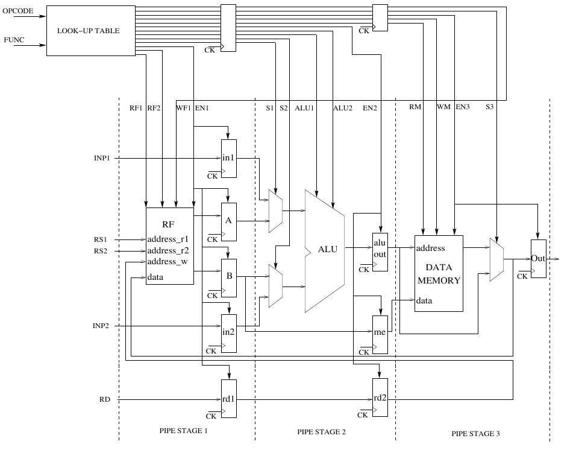

# Designer's assumptions

* Following the given diagram:
   
    we assumed that, in all the MUXes of the datapath, the top signal will be selected if the select signal is "1". On the other hand, the bottom input signal of the MUXes will be selected if the select signal is "0".

* We also assumed that the "EN3" signal should always be kept at '1' for each instruction in order to let flow the data from the stage 3 of the datapath to the external environment (even if the memory block present in stage 3 is not accessed). 
A better datapath, probably, would have got two distinct enable signals: one used to enable the memory in all of those operations that make access to it, while setting the second enable signal of the last register in all of those operations that require to output the data from stage 3.
Thus, two distinct enable signals will permit to reduce the energy consumption by keeping the memory "idle" when not used. Also, this could permit us to never worry about the data received at the inputs of the memory while enabled but intentionally not used.

* We encoded the `NOP` operation mapping it to a "special" `OR R1, R1, R1` operation. In fact, a bitwise `OR` between the content of the same register will result in a useless operation, since the result will be `R1` itself. Why we called it "special"? Because, as suggested by the lab assistants, the writeback operation is discarded. This permits to keep free the only write port available in the register file, thus avoiding possible structural stalls that may occur during the program execution. Also, avoiding to use the register file for a useless operation avoids useless power consumption.

# How to read waveforms and testbench

### **Waveforms**
In this folder we provide 3 different waveforms files: 

* The "OVERALL" one contains the entire time of simulation (going from 0 ns to 50 ns)
* The "PART1" file contains the first 25 ns of simulation
* The "PART2" file contains the last 25 ns of simulation

For the entire simulation time we test all the different instructions in a sequential manner. Since the entire structure is pipelined, at each clock cycle a new instruction is sento to the inputs of the CU.

#### Comments
Since the LUT is a pure combinational component, the reset signal will affect only the two registers used to propagate the control signals to the second and third stage.
We, as designers, suppose that the environment around our Control Unit and Datapath will not send any meaningful data to the inputs of the datapath if the Reset signal is active.

The waveforms are ordered following the below schema: each control signal is mapped to a certain bit of the *cw1*, *cw2*, and *cw3* control words.
Thus, starting from bottom to top we can read the control signals value and reconstruct the control word.

We must remember that the structure is entirely pipelined and so the control signals propagate with the correct timing in order to match the proper stage.
In the following picture we reported the mapping between the generated Control Word (CW1 in this case) and each of the control output signals generated by the Control Unit.

### **Testbench**
The testbench is pretty basic: we test all the possible instructions one after the other.
We firstly test RTYPE instructions (and so we provide both fUNC and OPCODE signals to the input of the DUT)
and finally we test all the ITYPE instructions (By providing only the OPCODE input signal).

At each instruction tested we also set the *currentInstruction* signal, in order to easily understand, while reading the waveforms, which instruction's `OPCODE` and `FUNC` we are sending as input to the Hardwired CU.

