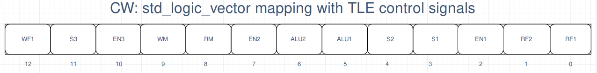

# How to read waveforms and testbench

### **Waveforms**
In this folder we provide 3 different waveforms files: 

* The "OVERALL" one contains the entire time of simulation (going from 0 ns to 50 ns)
* The "PART1" file contains the first 25 ns of simulation
* The "PART2" file contains the last 25 ns of simulation

#### Comments
Since the LUT is a pure combinational component, the reset signal will affect only the two registers used to propagate the control signals to the second and third stage.
We, as designers, suppose that the environment around our Control Unit and Datapath will not send any meaningful data to the inputs of the datapath if the Reset signal is active.

The waveforms are ordered following the below schema: each control signal is mapped to a certain bit of the *cw1*, *cw2*, and *cw3* control words.
Thus, starting from bottom to top we can read the control signals value and reconstruct the control word.

We must remember that the structure is entirely pipelined and so the control signals propagate with the correct timing in order to match the proper stage.

### **Testbench**
The testbench is pretty basic: we test all the possible instructions one after the other.
We firstly test RTYPE instructions (and so we provide both fUNC and OPCODE signals to the input of the DUT)
and finally we test all the ITYPE instructions (By providing only the OPCODE input signal).

At each instruction tested we also set the *currentInstruction* signal, in order to easily understand, while reading the waveforms, which instruction's OPCODE and FUNC we are sending as input to the Hardwired CU.

