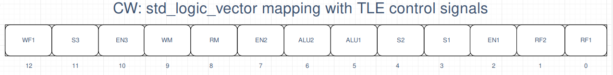

# How to read waveforms and testbench

### **Waveforms**
In this folder we provide 3 different waveforms files: 

* The "OVERALL" one contains the entire time of simulation (going from 0 ns to 130 ns)
* The "PART1" file contains from 30 ns to 60 ns (circa) of simulation
* The "PART2" file contains from 60 ns to 90 ns (circa) of simulation
* The "PART3" file contains from 90 ns to 130 ns (circa) of simulation

For the entire simulation time we test all the different instructions in a sequential manner. Since the entire structure is NOT pipelined, every 3 clock cycles a new instruction is sent to the inputs of the CU.

#### Comments

We, as designers, suppose that the environment around our Control Unit and Datapath will not send any meaningful data to the inputs of the datapath if the Reset signal is active.
The file `mytypes.vhd` is now different from the previous Control Unit Implementations, in order to satisfy the new requirements and to adapt the control Unit to a MicroProgrammed Approach.
(Addresses and memory).

Most of the comments are embedded in the code.

### **Testbench**
The testbench is pretty basic: we test all the possible instructions one after the other.
We firstly test RTYPE instructions (and so we provide both fUNC and OPCODE signals to the input of the DUT)
and finally we test all the ITYPE instructions (By providing only the OPCODE input signal).

At each instruction tested we also set the *currentInstruction* signal, in order to easily understand, while reading the waveforms, which instruction's `OPCODE` and `FUNC` we are sending as input to the Hardwired CU.

