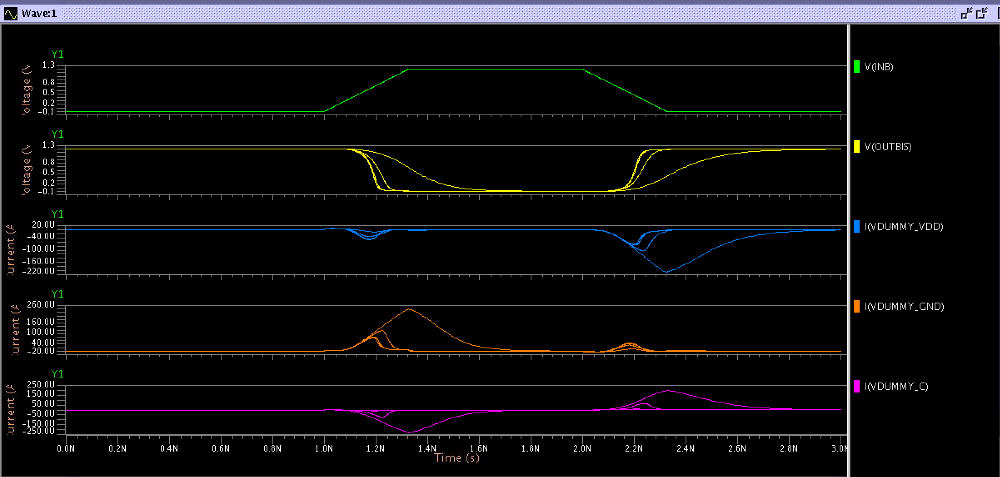
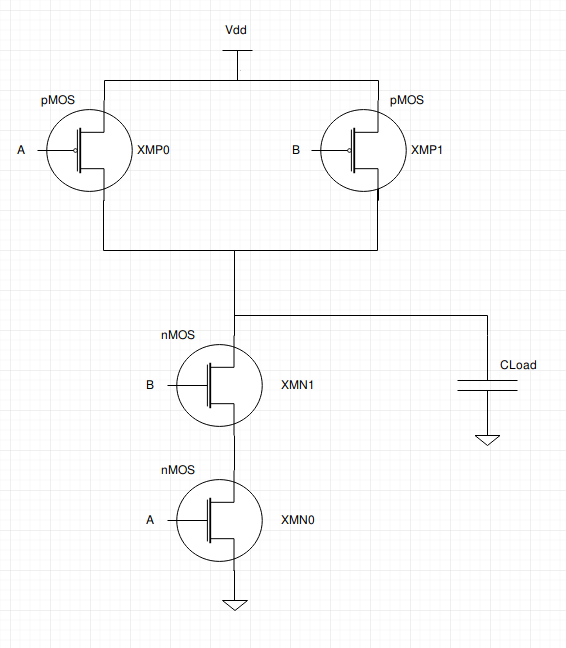
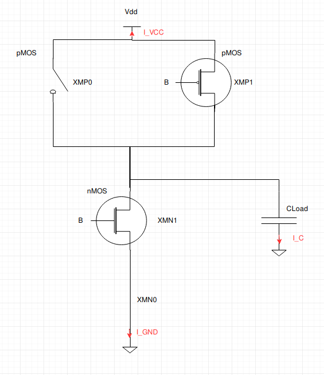

# Comments for Ex5.2

## Measurements

The **SPICE** simuation is done using 5 different `CLoad` values (*0.005 fFarad, 0.05 fFarad, 0.5 fFarad, 5.0 fFarad, 50.0 fFarad*).
In the next table we report all the current values obtained during the ELDO simulation:

| Load     | maxIgndF  | maxIVddR   | maxIgndR  | maxIvddF   | maxIloadF  | maxIloadR |
| -------- | --------- | ---------- | --------- | ---------- | ---------- | --------- |
| 0,005 fF | 7.653E-05 | -7.001E-05 | 4.588E-05 | -4.791E-05 | -1.260E-07 | 1.151E-07 |
| 0,05 fF  | 7.706E-05 | -7.042E-05 | 4.569E-05 | -4.768E-05 | -1.250E-06 | 1.143E-06 |
| 0,5 fF   | 8.196E-05 | -7.438E-05 | 4.406E-05 | -4.564E-05 | -1.164E-05 | 1.064E-05 |
| 5,0 fF   | 1.166E-04 | -1.028E-04 | 3.469E-05 | -3.437E-05 | -7.528E-05 | 6.757E-05 |
| 50,0 fF  | 2.408E-04 | -2.092E-04 | 1.257E-05 | -1.104E-05 | -2.304E-04 | 1.997E-04 |

## Waveforms 

On the above image we can observe the behavior of our NAND gate under a certain imput combination.
In fact, the input voltage on the pin `INA` is kept at a high level (1.2V) for the entire measurement and so not reported in the waveforms (since no transition will happen on this input).

* The first (green) waveform corresponds to the input voltage on the input pin `INB`.
* The second (yellow) waveform corresponds to the output voltage on the output capacitance.
* The third (blue) waveform corresponds to the current measured on the `Vdd` pin.
* The fourth (orange) waveform corresponds to the current measured on the `GND` pin.
* The fifth (purple) waveform corresponds to the current measured on the Load Capacitance.

## What happens?

Since the `INA` voltage is kept at a high level for the entire time of the simulaiton while the `INB` voltage firstly transitions from Low to High and then from High to Low, the output "follows" (and complements) the transition on the input pin `INB`.

We reported the general structure in the following circuit, as it is described in the *SPICE* files:

  
Below we show the same circuit considering that the voltage on the input pin `INA` is at a High level voltage for the entire period of the simulation, as long as the directions of the currents measured:

As you can see the `INA` PMOS (`XMP0`) acts like an open circuit, while the `INA` NMOS (`XMN0`) acts like a short circuit.

### **`INB` Low to high transition**

We can now analyze what happens during the `INB` voltage transition from a Low logic level to the High logic level (from 1ns to 1.2ns in the previous graph):

As we can see from the waveforms, at each load capacitance corresponds different shapes of the same waveform. In general, if we increase the load capacitance the overall output trasition will be slower (yellow waveform) for both the trasitions.
For the currents (blue, orange, purple waveforms) we can see another general rule of thumb: if we increase the load capacitance the current that flows on the different branches of the circuit will be higher.

By looking more closely at the orange waveform (Current on the GND branch) we can clearly appreciate that a higher capacitance means a higher current peak. Since the `XMN1` NMOS transistor is closing during the `INB` transition from Low to High, the current is starting to flow from the capacitance (which is charged and starts to discharge), flowing through the NMOS transistors (`XMN0` and `XMN1`) and finally flowing to the ground terminal. A higher load capacitance thus means more charges to move in the unit of time and so more current to transfer from the capacitance to ground.

By looking at the purple waveform (current on the capacitance) we can see a very similar current trend, but with the opposite sign. This happens because the current has been supposed, on the capacitance, to flow to ground. In this case the current is doing exactly the opposite, flowing from the capacitance to ground but passing through the NMOS transistors (and so following a counter-clockwise direction).

By looking at the blue waveform (current on the VDD terminal) we can see a more subtle behavior. In fact there's a very small peak of current (compared to the other ones at the same timestamp) that represents the Short Circuit current flowing on the transistors.
This happens because, for a very small amount of time both the `XMP1` and `XMN1` transistors are switching (the first ON->OFF while the second OFF->ON), and so both the transistors are ON at the same time.
Thus, current is flowing from VDD directly to GND for this small amount of time.
This also explains why the peaks on the GND current are higher than the peaks of the current flowing from the capacitance: the GND current is exactly the sum of the VDD current and the Capacitance current.

### **`INB` Low to high transition**
For this second transition we can apply the same considerations we applied to the previous case. 
Still, in this case the `XNMP1` transistor will go from a OFF state to a ON state, while the `XMN1` transistors will go from a ON state to a OFF state (`INB` is going from 1.2V to 0V).
Thus, in this case, the load capacitance will be charged and the current flowing in it will assume a positive sign. 