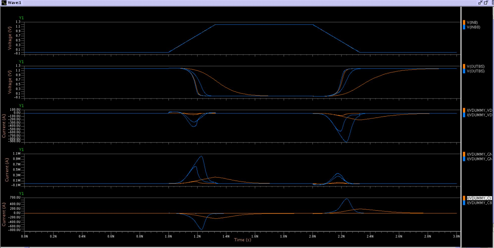
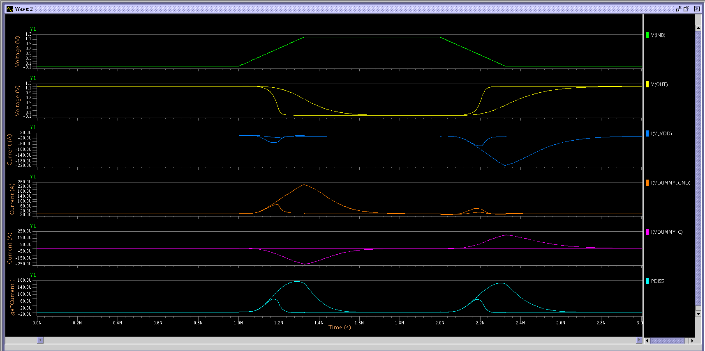
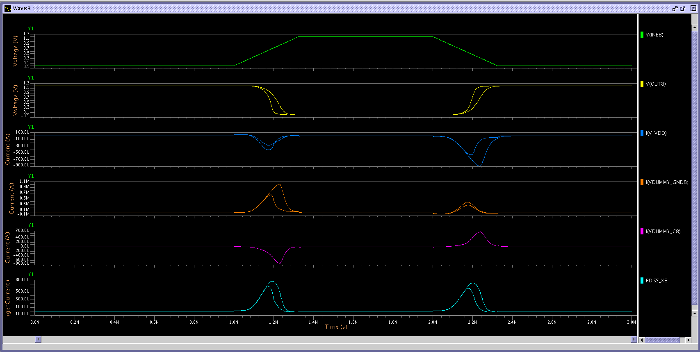

# Comments for Ex5.5

## **Intro and netlist analysis**

The **SPICE** simuation is done using 2 different `CLoad` values (*5.0e-17 Farad and 5.0e-14 Farad*) as long as two different NAND gates.
The first NAND gate is described in the file `nandHScharMaxLoad.sp` while the second one is described in the file `nandHSX8MaxLoad.sp`.

As we can see from the subcircuit file that describes both the NANDs (`CMOS013.spi`), the first NAND is composed by 4 transistors having the gate Width equal to W=0.640, while the second NAND is composed by 16 transistors (8 NMOS type and 8 PMOS type).
The 8 NMOS transistors have a Width equal to `W=1.280U`. The 8 PMOS transistors have a Width equal to `W=2.050U`.

The increase of the Width of these trasnsistor permits to the entire NAND circuit to drive bigger loads (an increased Width permits higher currents to flow from Drain to Source and so a lower propagation time).
Also the increased number of transistors permits to "spread" the current on a multiple number of MOS channels, thus by again increasing the driving capabilitues of the entire NAND.

Finally, the channel Width of the PMOSes is near the double of the channel Width of the NMOSes because of the intrinsic lower mobility that affects the PMOSes. To compensate the slower mobility we thus need a bigger channel, that's why the PMOSes have a W=2.050U.

This is why we expect a higher driving capability from the second NAND (`nandHSX8MaxLoad.sp`).

The measured values obtained during the simulations can be found in the `measured_values.txt` file. 

## **Waveforms** 

On the above image we opened both the waveforms coming from the simulation of both the NANDs with the 2 different Cload values.
The blue waveforms refer to the `nandHSX8MaxLoad` NAND, while the orange ones refer to the `nandHScharMaxLoad` NAND.
we can appreciate the different driving capabilites by observing the `V(OUTBIS)` graph: the first NAND (orange waveform), in the case of the bigger load, has a really "smooth" and slow output transition: this behavior is reflected by the delay values obtained for both rising-falling times and propagation delays (refer to the `measured_values.txt` file).
At the same time, we can clearly see how the second NAND gate (`nandHSX8MaxLoad`) behaves better in case of the highest load (blue wave).
This behavior reflects itself also on the current waveforms: as we see the second NAND gate reaches higher current peaks than the first one: more charges can be transfered in the time unit thanks to the larger channel and the increased number of MOS transistors in the same subcircuit. Thus, even if in the case of a big load capacitance, the NAND gate is able to drive it correctly.

Let's now analyze the power dissipation on both the NAND gates, with both the load capacitances.

### **First NAND gate**

The dissipated power is reported on the graph using the cyan wave (the last one from top to bottom) and it has been computed starting from the measurements and waves already available with the following equation.

`Pdiss = (Vdd - Vout)*Ivdd + (Vout * Ignd)`

By doing this we reported the power dissipated by both the PMOS and NMOS transistors.
As we can see, the peak values reach the 180µW.

### **Second NAND gate**

The dissipated power is reported on the graph using the cyan wave (the last one from top to bottom) and it has been computed starting from the measurements and waves already available with the following equation.

`Pdiss = (Vdd - Vout)*Ivdd + (Vout * Ignd)`

By doing this we reported the power dissipated by both the PMOS and NMOS transistors.
As we can see, the peak values reach the 800µW.

The difference between the two NAND gates is evident: the second NAND, due to the highest current peaks reached has obviously a higher power dissipation.